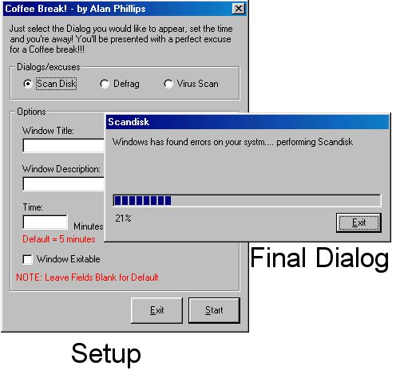



## Coffee Break\!\!\!

### Description

This code is GREAT, Have you ever sat there at work and thought 'I Could Really Use A Coffee Break, but....my boss is just around the corner'? Well this code is the thing for you!! What it does is: you select the dialog you would like to appear set a time it should be on the screen for and there you are.... you could have a fake scandisk that'll conveniently last for however long you want (while you have a coffee)!

----

Oh and please please pleas Vote for me no matter how good/bad you think this code is.... it'll help me to improve future versions + it lets me know how i'm doing in VB =)
 
### More Info
 
COULD get you in trouble if you missuse it..

             |
---                |---
**Submitted On**   |2000-05-03 19:46:40
**By**             |[Alan Phillips](https://github.com/Planet-Source-Code/PSCIndex/blob/master/ByAuthor/alan-phillips.md)
**Level**          |Intermediate
**User Rating**    |3.8 (23 globes from 6 users)
**Compatibility**  |VB 5\.0, VB 6\.0
**Category**       |[Complete Applications](https://github.com/Planet-Source-Code/PSCIndex/blob/master/ByCategory/complete-applications__1-27.md)
**World**          |[Visual Basic](https://github.com/Planet-Source-Code/PSCIndex/blob/master/ByWorld/visual-basic.md)
**Archive File**   |[CODE\_UPLOAD5502542000\.zip](https://github.com/Planet-Source-Code/alan-phillips-coffee-break__1-7814/archive/master.zip)

